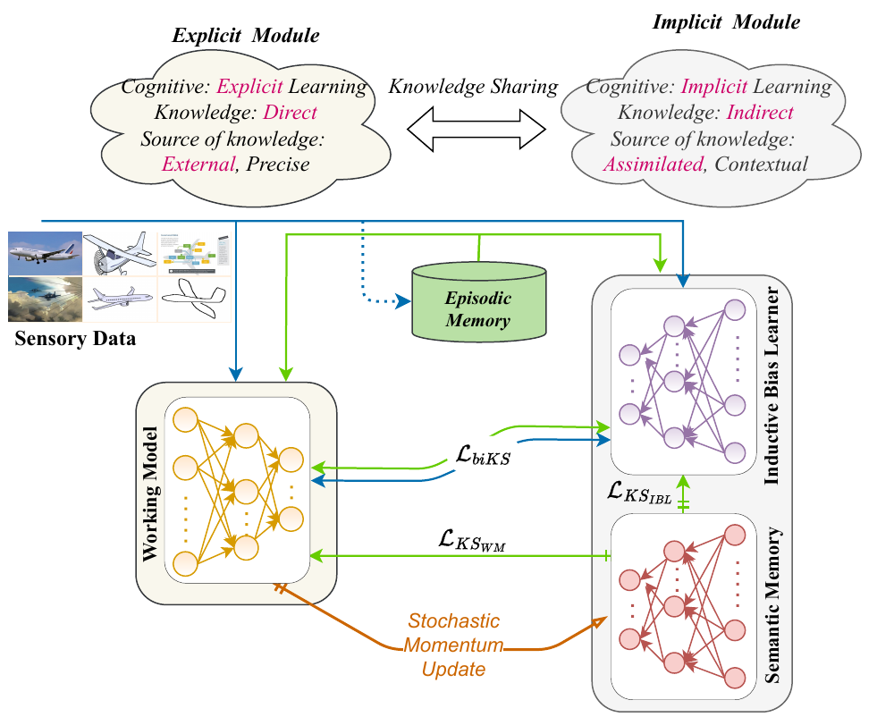
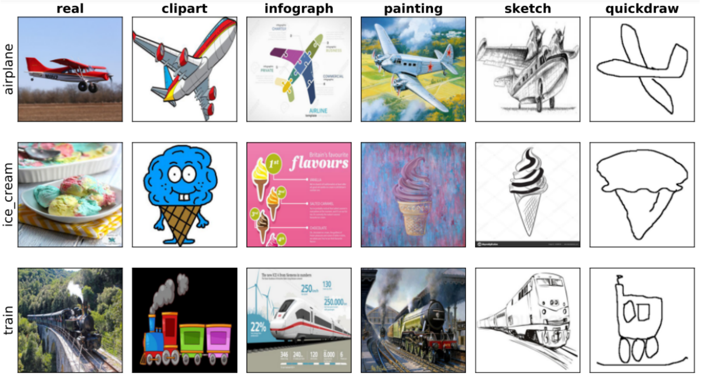
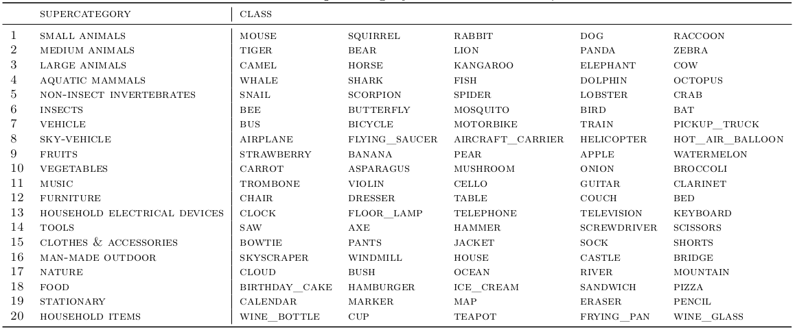
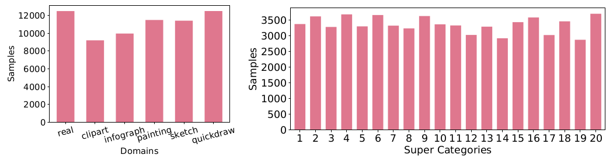
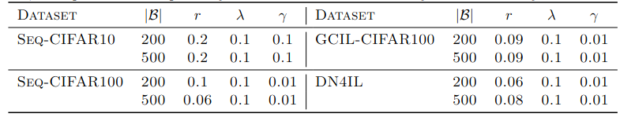

This is the official code for TMLR paper, "Dual Cognitive Architecture: Incorporating Biases and Multi-Memory Systems for Lifelong Learning" by Shruthi Gowda, Elahe Arani and Bahram Zonooz.

## Requirements
- python==3.8.0
- torch==1.10.0
- torchvision==0.8.0 

## Methodology

####DUCA framework

'Dual Cognitive Architecture (DUCA)' : The explicit module features a working model that is dedicated to learning direct sensory data. In the implicit module, the inductive bias learner encodes prior shape-related knowledge, while the semantic memory submodule consolidates information originating from the explicit module. During the inference process, a single network, specifically the semantic memory, is employed, as it contains consolidated knowledge encompassing all tasks.

[//]: # (![image info]&#40;./src/DUCA.png&#41;)



## New Dataset - "Dn4IL"

We introduce a new dataset for the Domain-IL setting. It is a subset of the standard DomainNet dataset used in domain adaptation. It consists of six different domains: real, clipart, infograph, painting, quickdraw, and sketch. The shift in distribution between domains is challenging. A few examples can be seen in Figure 



Details on supercategory and classes in DN4IL dataset.




## Setup

DUCA is trained and tested on four different datasets using ResNet18 architecture. The learning rate is set to 0.03, batch
size to 32, and epochs to 50 respectively for all the datasets. The decay factor d is always set to 0.999.



## Running

####Train InBiaseD
```
best_params_dn4il = {
    200: {'lr': 0.05,
          'minibatch_size': 32,
          'batch_size': 32,
          'n_epochs': 50,
          'aux': 'shape',
          'img_size': 64,
          'shape_filter': 'sobel',
          'lamda': 0.1,
          'gamma': 0.01,
          'd': 0.999,
          'r': 0.06
          },
    500: {'lr': 0.05,
          'minibatch_size': 32,
          'batch_size': 32,
          'n_epochs': 50,
          'aux': 'shape',
          'img_size': 64,
          'shape_filter': 'sobel',
          'lamda': 0.1,
          'gamma': 0.01,
          'd': 0.999,
          'r':0.08
          },
}
```

```
buffer_size = 200 (or 500)
train_params = best_params_dn4il[buffer_size]
python main.py 
    --experiment_id domainIL_exp_dn4il_dataset \
    --seed 0 \
    --model duca \
    --dataset dn4il \
    --buffer_size {buffer_size} \
    --aux {train_params['aux']} \
    --lr {train_params['lr']} \
    --minibatch_size {train_params['minibatch_size']} \
    --n_epochs {train_params['n_epochs']} \
    --img_size {train_params['img_size']} \
    --shape_filter {train_params['shape_filter']} \
    --batch_size {train_params['batch_size']} \
    --output_dir /output/ \
    --loss_wt {train_params['lamda']} {train_params['gamma']}
    --ema_alpha {d} \
    --ema_update_freq {r} \
    --tensorboard \
    --csv_log \
```

##Cite Our Work

## License

This project is licensed under the terms of the MIT license.

